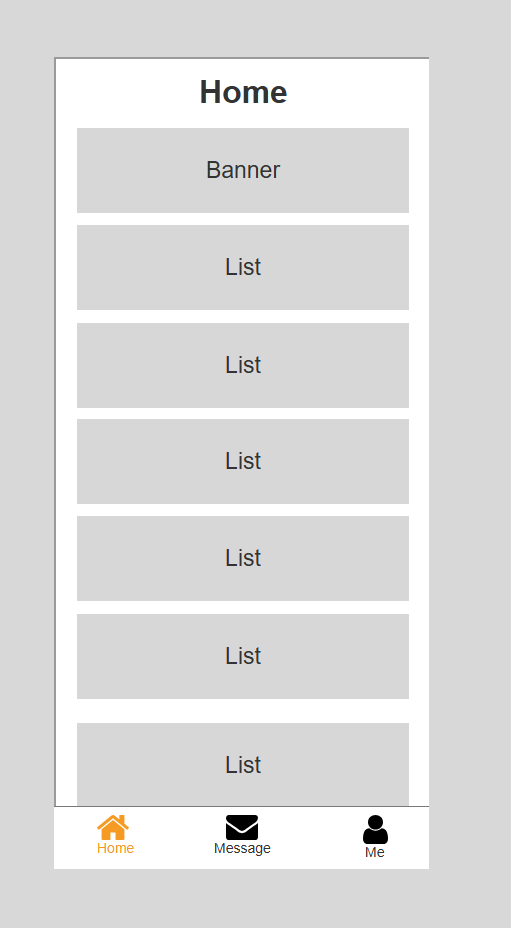
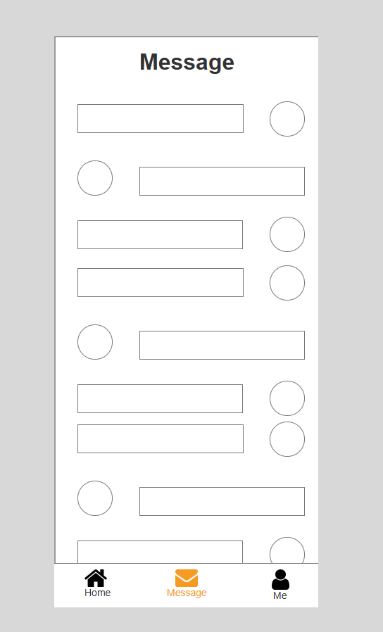
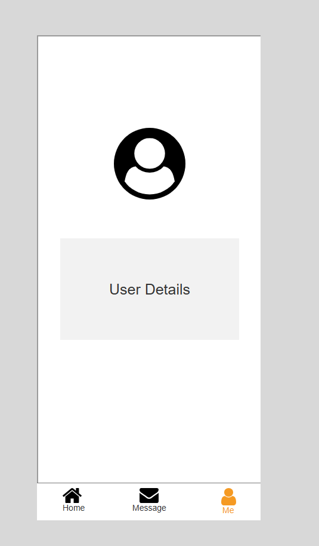

# Day09-Practicals

### Tab Bar Navigation 📱

**Project Focus**: Mobile-style tab navigation with three sections (Home, Message, Me) using inline frames and interactive tabs.

---

#### Core Components 🧩

1. **Tab Bar**
   - Three tabs with icons + labels:
     - 🏠 Home
     - 💬 Message
     - 👤 Me
   - Hotspots covering each tab area
2. **Inline Frame**
   - Border width increased for visual distinction
   - Displays content from sub-pages
3. **Sub-Pages**
   - `Home`: Heading + content boxes
   - `Message`: Avatars + message bars
   - `Me`: User profile content

---

#### Implementation Guide 🛠️

**Step 1: Tab Bar Setup**

```axure
1. Create tab bar at bottom
2. For each tab:
   - Add icon (e.g., home icon)
   - Add label ("Home", "Message", "Me")
   - Cover with hotspot → Name: HomeHotspot, MessageHotspot, MeHotspot
3. Set Selected Style for all icons/labels:
   - Fill Color: Yellow (#FFD700)
   - Apply to both default and selected states
```

**Step 2: Inline Frame & Sub-Pages**

```axure
1. Add Inline Frame (main content area)
2. Right-click → Toggle Border → Increase border width
3. Create sub-pages:
   - HomePage: Heading "Home" + content boxes
   - MessagePage: Avatar circles + thin message bars
   - MePage: Profile content
4. Add bottom hotspot to each sub-page (prevents scroll overlap)
```

**Step 3: Interactions & Selection Group**

```axure
1. Create Selection Group:
   - Name: "TabGroup"
   - Assign to all hotspots
2. Set default: HomeHotspot selected
3. HomeHotspot Interaction:
   OnClick:
     • Set Selected: HomeHotspot
     • Open Link in Frame: HomePage → Target: [InlineFrame]
4. Repeat for other tabs:
   MessageHotspot → MessagePage
   MeHotspot → MePage
```

---

#### Visual Preview 🎨





---

#### Key Features ⚙️

1. **Tab Selection Logic**
   - Only one tab active at a time (Selection Group)
   - Visual feedback via yellow highlight
2. **Content Switching**
   - Seamless page transitions via inline frame
3. **Scroll Management**
   - Bottom hotspots prevent content clipping
4. **Visual Consistency**
   - Uniform border width for inline frame
   - Standardized tab styling

---

#### Axure Cloud Hosting ☁️

Access the live prototype:  
🔗 [Tab Navigation Demo on Axure Cloud](https://64gvzm.axshare.com)

---

#### How to Use the RP File 📂

1. Open `Tab bar navigation.rp` in **Axure RP 9/10**
2. Preview

---

#### License 📜

MIT License - See [LICENSE](LICENSE) for details.
